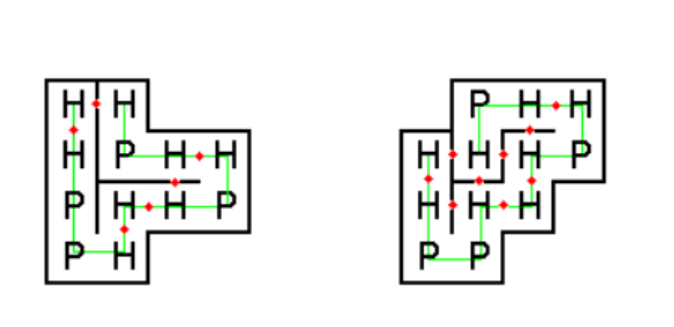

# hpfolding
HP Folding Optimisation Model

Chapter 7.2 - Integer Linear Programming in Computational and Systems Biology

Author: Dan Gusfield Protein Foldering via the HP Model.

In a very simplified form, we can consider proteins as strings consisting of hydrophobic (H) and polar (P) elements, e.g. HHPPHHHPHHPH. 

For this problem, the orientation of a protein is important; e.g.  HPP is considered distinct from PPH. Thus, there are distinct proteins consisting of elements. image.png When one encounters these strings in nature, they are always folded in such a way that the number of H-H contact points is as large as possible, since this is energetically advantageous. As a result, the H-elements tend to accumulate in the inner part, with the P-elements on the outside. Natural proteins are folded in three dimensions of course, but we will only consider protein folding in two dimensions.
